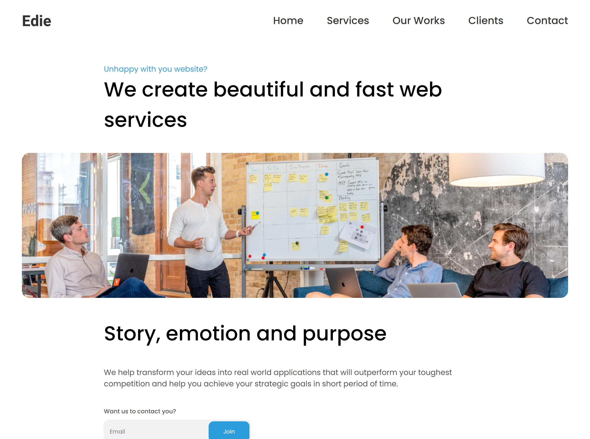

<!-- Please update value in the {}  -->

<h1 align="center">Edie homepage</h1>

   Solution for a challenge from  <a href="http://devchallenges.io" target="_blank">Devchallenges.io</a>.

  <h3>
    <a href="https://quirky-stonebraker-00fb87.netlify.app/">
      Demo
    </a>
     | 
    <a href="https://quirky-stonebraker-00fb87.netlify.app/">
      Solution
    </a>
     | 
    <a href="https://devchallenges.io/challenges/xobQBuf8zWWmiYMIAZe0">
      Challenge
    </a>
  </h3>

<!-- TABLE OF CONTENTS -->

## Table of Contents

- [Overview](#overview)
  - [Built With](#built-with)
- [Contact](#contact)

<!-- OVERVIEW -->

## Overview

- you can see my demo [here](https://quirky-stonebraker-00fb87.netlify.app/)
- I learned about transition, practice my grid and flex skills.
- I impoved my mobile responsibe skills

### Built With

<!-- This section should list any major frameworks that you built your project using. Here are a few examples.-->

- [HTML]
- [CSS]
- [JS]

<!-- This section should list any articles or add-ons/plugins that helps you to complete the project. This is optional but it will help you in the future. For example -->

## Contact

- Website [kevin-cay.com](https://portfolio-kevin-cay.vercel.app/)
- GitHub [@Kevin-Cat](https://github.com/Kevin-Cay)